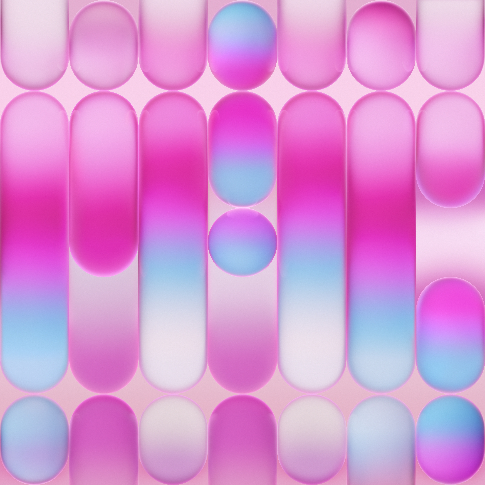

# Neo Blush

A pink glass desktop for NixOS and Hyprland, with a matching SDDM login screen,
Waybar menu bar, Control Center, Dynamic Island, Rofi launcher, Kitty, styled
file managers, browser appearance, notifications, and lock screen.



Use it as NixOS and Home Manager modules, or start your own configuration from
the included template. The flake pins NixOS and Home Manager 26.05 and exports
packages for `x86_64-linux` and `aarch64-linux`. The optional HyprGlass plugin
supports x86_64 and defaults to disabled on other architectures.

```text
flake.nix
|
+-- nixosModules.default ------ Hyprland, SDDM, desktop system services
+-- homeManagerModules.default Waybar, applications, appearance, monitors
+-- packages.<system> --------- Desktop tools and launchers
+-- templates.default --------- Starter using your own account and hardware
|
+-- modules/neo-blush/ --------- System, home, monitor and package modules
+-- config/ ------------------- Desktop configuration, helpers and assets
'-- sddm/neo-glass/ ------------ Login screen, status plugin and Qt tests
```

## Start on a NixOS machine

Create a separate directory for your own machine configuration:

```bash
mkdir my-nixos
cd my-nixos
nix flake init -t github:Nikko-Kostenko/neo-blush
sudo nixos-generate-config --show-hardware-config > hardware-configuration.nix
```

Set your hostname, architecture, and username in the generated files. Copy
your existing bootloader and additional hardware settings into `configuration.nix`,
set your timezone, and preserve your original `system.stateVersion` and
`home.stateVersion`. The example assumes UEFI/systemd-boot; adapt it to your
installation. For live media, generate hardware with the correct `--root /mnt`.

Replace `my-pc` with your hostname:

```bash
nix flake check --no-build "path:$PWD"
sudo nixos-rebuild test --flake "path:$PWD#my-pc"
sudo nixos-rebuild switch --flake "path:$PWD#my-pc"
```

For a new account, run `sudo passwd <username>`. Log into Hyprland. SDDM loads
the new theme on its next start; rebuilding does not end your current session.
The desktop wallpaper downloads on first login and is reused afterward; the
login-screen wallpaper is bundled for offline use.

Commit your machine files and `flake.lock` in your own repository. Keep private
keys and credentials outside the checkout: `path:` flakes also copy ignored
files into the Nix store. To update Neo Blush, run `nix flake update neo`, then
validate and rebuild.

## Add to an existing flake

Follow the theme's pinned dependencies for compatible Hyprland and plugin
versions:

```nix
inputs = {
  neo.url = "github:Nikko-Kostenko/neo-blush";
  nixpkgs.follows = "neo/stableBranch";
  home-manager.follows = "neo/home-manager";
};
```

Add `neo.nixosModules.default` and the Home Manager NixOS integration to your
system's module list. Add `neo.homeManagerModules.default` to your user's Home
Manager imports. A system module can wire the Home Manager integration like this:

```nix
{
  nixpkgs.config.allowUnfree = true; # The desktop includes Vivaldi.
  home-manager = {
    useGlobalPkgs = true;
    useUserPackages = true;
    users.alice.imports = [ neo.homeManagerModules.default ./home.nix ];
  };
}
```

Keep your account, hardware, bootloader, state versions, and Git identity in
your own configuration. The NixOS module enables SDDM; disable any other display
manager before applying it. The home module manages the Hyprland, Waybar, Kitty,
and Rofi configuration and applies appearance preferences to the included apps.

## Customize

Set monitors in your Home Manager configuration:

```nix
neo.hyprland.monitors = [
  { output = "DP-1"; mode = "2560x1440@144"; scale = "1"; }
  { output = "HDMI-A-1"; position = "2560x0"; scale = "1"; }
];
```

Defaults use preferred modes with automatic placement and scaling. To disable
the optional blur plugin, set `neo.hyprglass.enable = false;` in Home Manager.
To add your own login photo, set these options in a NixOS module:

```nix
neo.sddm.avatar = ./avatar.jpg;
neo.sddm.avatarUser = "alice";
```

The default login screen uses the account's initial. Inter and standard icon
fallbacks are included. Optional local SF Pro fonts and symbols can be imported
with `config/waybar/control-center/import-apple-assets.py`; the tools keep those
font files in your local user data directory.

## Desktop controls

| Shortcut | Action |
| --- | --- |
| Super+Space / Super+R | Application launcher |
| Super+Q | Kitty |
| Super+E | Files (styled Thunar) |
| Super+L | Lock |
| Super+M | Session menu |
| Super+N | Notification Center |
| Super+Shift+V | Clipboard history |
| Super+Shift+S | Area screenshot |

See [NEO-THEME.md](NEO-THEME.md) for desktop details and
[sddm/neo-glass/README.md](sddm/neo-glass/README.md) for the login screen.
The [UI task list](UI-TASKS.md) tracks further refinements.

## Build and validate

From a checkout of this theme repository:

```bash
nix flake check --no-build --all-systems "path:$PWD"
nix build "path:$PWD#neo-control-center"
nix build "path:$PWD#neo-dynamic-island"
nix build "path:$PWD#neo-files"
```

Named packages also include `neo-dolphin`, `neo-screenshot`, `neo-waybar`,
`vivaldi-neo`, `vivaldi-neo-asset-tools`, `neo-python`, and `neo-hyprglass` on
supported architectures. The formatter is available through `nix fmt`.

Wallpaper source: [iDownloadBlog's original MacBook Neo wallpapers](https://www.idownloadblog.com/2026/03/11/macbook-neo-wallpapers/).
Cursor and Qt theme assets come from the pinned WhiteSur packages in Nixpkgs.
